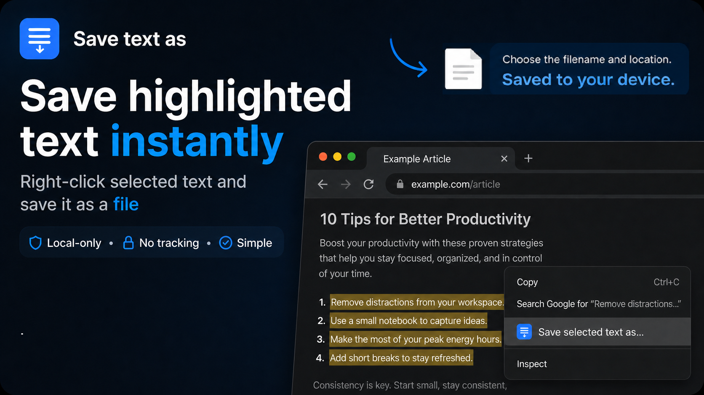

# Save Selected Text As

Save highlighted webpage text as a local file.

## How to use

1. Select text on a webpage.
2. Right-click and choose **Save selected text as...**, or click the extension toolbar icon.
3. Choose where to save the file.
4. Keep the default `.txt` extension, or rename it with another text-based extension such as `.md`, `.json`, `.csv`, `.cpp`, `.js`, or `.html`.

The extension saves plain text content. Changing the file extension changes the filename, but it does not convert the text into a different file format.

If no text is selected, the toolbar icon briefly changes color.

## Privacy

Selected text is used locally only to create the file download. The extension does not collect or send user data.

